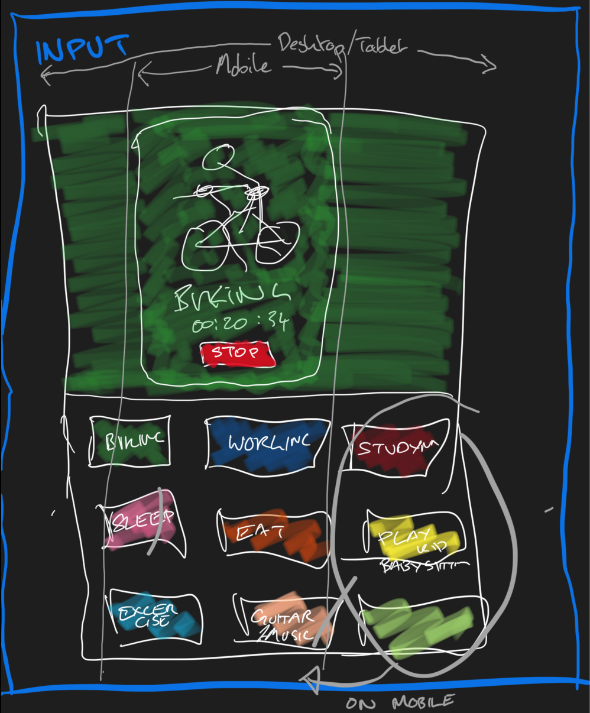
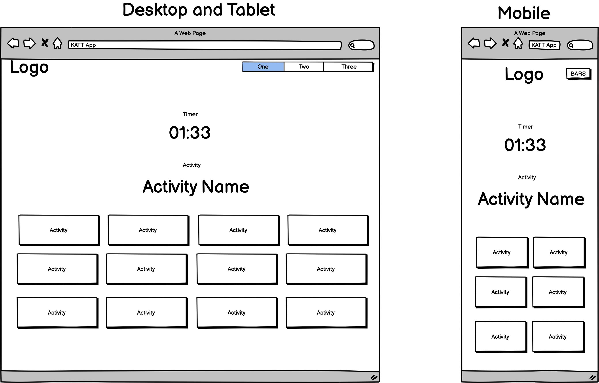
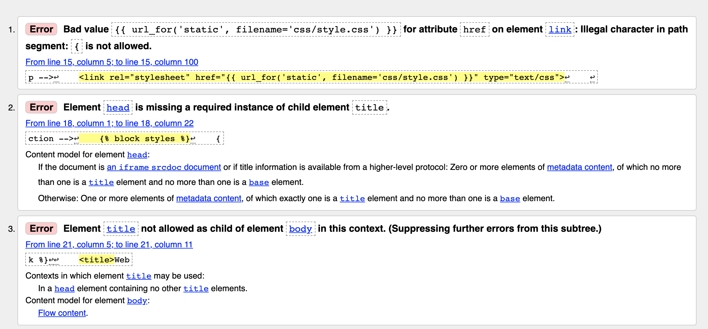
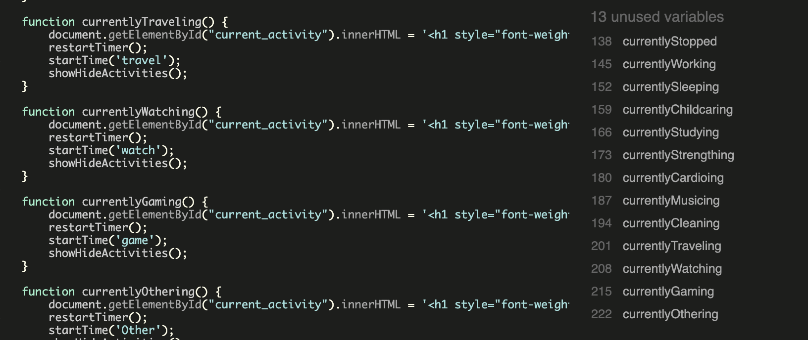
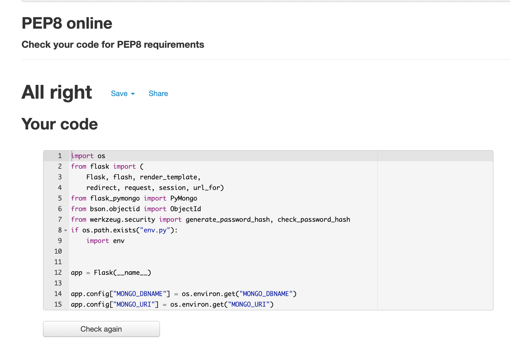
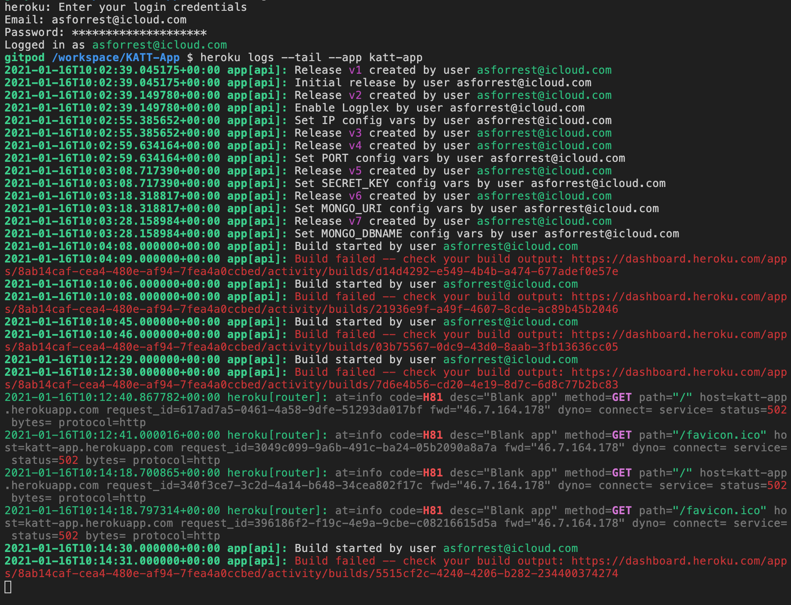

# Data Centric Development Milestone Project: KATT App
This project has been [deployed to Heroku](https://katt-app.herokuapp.com/) and the source code is available in a [repository on GitHub](https://github.com/asforrest/KATT-App)

This is a web app created for the 3rd Milestone Project for [Code Institute course: Full Stack Development](https://codeinstitute.net/full-stack-software-development-diploma/).

This web app will make use of technologies covered in the course up to this point including HTML, CSS, Python, Flask and MongoDB in order to demonstrate an understanding of these technologies.

This web app aims to solve a real-world problem by assisting users with their time management.

## UX (User Experience)
This project was developed because the creator of this app, Alexander Forrest, was looking for a simple and effective way to monitor the time he spends on a specific tast.

There are currently other time tracking solutions, but these apps are often bloated with unused features. The goal therefore is to keep this project as simple as possible as to be effective as possible.

Here is an overview of different types of potential users and what they may want to achieve with KATT:

### User Stories
- #### As a first time visitor:
    1. I want to have a clear understanding about how to use KATT.
    1. I want to understand how to move around the Web App intuitively and have clear path finding.
    1. I want to be able to easily enter my activities.
    1. I want to clearly see how long I've been on a particular task.
    1. I want to be able to edit and delete entries when I want to correct a registration.

- #### A a returning visitor:
    1. I want to achieve the same goals as a first time vistor (please see the points for first time vistor)

- #### As a potential employer looking for a software developer:
    1. I want to get a sense of Alexander's ability to manipulate databases and present the data clearly to users.
    1. I want to see that Alexander understands the technologies he's working with.

- #### As the site owner:
    1. I want to create a web app that I can be proud off.
    1. I want to minimalise or eliminate bugs to provide a seemless experience to users.
    1. I want to demonstrate to the Code Insitute evaluator that I have an understanding of the technologies that I'm working with.
    1. I want to impress potential employers with my work.

### Wireframes
Original Sketch:

Wireframes:

### Colors
The color pallete was choosen as to be friendly and welcoming and care was taken not to use harsh colors as the app should be left open while tracking time. If the app is visable, softer colors will be calmer.

Contrasting colors are also great design choices as they can compliment each other and make site navigation easier.

The Materialize colors were taken as a basis, then a strong (but soft) red was chosen as a main accent color with greens to compliment the red. Buttons are a combination of green, blue and red depending on the function.

The main colors are:

### Fonts
The font-family used for this website comes from Google Fonts and is a sans-serif font: 'Montserrat'. This font is professional and playful and therefor suits the goals of this project.

### Framework
The choice was made to use Materialize CSS for this projcet because:
1. Experience a new grid framework (other then Bootstrap).
1. Many design elements are in place, so this saves time as there is less need for custom CSS.

## Methodolgy
The creator of this web app, Alexander, found it easy to put himself in the shoes of potential user due to using the product himself. 

Alexander has a background in video production which gives him a unique perspective when trying to look at a problem from multiple viewpoints.

The methodology of this project will be based on one core principals during development:

- #### The principle of always delivering a [Potentially Shippable Product](https://less.works/less/framework/potentially-shippable-product-increment)
    1. This means that the product is always working after a coding session, albeit in a basic form.
    1. The product could potentially be submitted at any time.
    1. Constantly having a working product gives more room for refinement.

## Process
When taking the methodology into account the following process has been created:
- #### Planning
    1. Brainstorming sessions about minimum required core elements.
    1. Brainstorming sessions about stretch goals and the future of the web app.
    1. Contact with the Code Institute appointed mentor for guidance and real world experience.
    1. Discussing the project with friends and family to get input.
    1. Drawing out the structure on paper and creating wireframes to server as a guideline for responsive development.

- #### Creating basic functionality
    1. The main focus was CRUD - Create, Read, Update, Delete - these are essential functions to demonstrate database manipulation.

- #### Creating basic user interface and structure
    1. Selecting a color palette.
    1. Finalising design elements.

- #### Evaluation
    1. More brainstorming about potential user interactivity elements.
    1. More brainstorming about potential feature and functions.
    1. Discussion with the Code Institute appointed mentor to see what areas need improvement.

- #### Repeat Where Needed
    1. During this final step it's important to have a prioritised overview as to what is important or unimport, urgent or not. Choise need to be made and the scope may need to be boundaried or expanded.

## Features
### Existing Features
1. Track amount of time doing a task.
1. Users can only see there own data and get an overview of all their data on a dashboard.
1. Editing and delting records.

### Features Left To implement
1. Graphing the information.
1. Customise different viewing options for improved user experience.
1. Add inspirational quotes that are randomly shown when opening the app.
1. Create API to share the data.
1. Create search functionality on the dashboard.
1. Create a global dashboard with aggrigated data about all users.
1. Add more data interactivity on the dashboard, like ordering by different headers.

## Technologies Used

### Languages Used
-   [HTML5](https://en.wikipedia.org/wiki/HTML5)
-   [CSS3](https://en.wikipedia.org/wiki/Cascading_Style_Sheets)
-   [JavaScript](https://en.wikipedia.org/wiki/JavaScript)
-   [Python3](http://https://en.wikipedia.org/wiki/Python_(programming_language)
-   [Jinja](https://en.wikipedia.org/wiki/Jinja_(template_engine))

### Frameworks, Libraries & Programs Used

1. [Materialize:](https://materializecss.com/)
    - Materialize was used to assist with the responsiveness and styling of the website.
1. [Google Fonts:](https://fonts.google.com/)
    - Google fonts were used to import the 'Titillium Web' font into the style.css file which is used on all pages throughout the project.
1. [jQuery:](https://jquery.com/)
    - jQuery came with Bootstrap to make the modals work properly, as well as simplifies DOM manipulation.
1. [Git](https://git-scm.com/)
    - Git was used for version control by utilizing the Gitpod terminal to commit to Git and Push to GitHub.
1. [GitHub:](https://github.com/)
    - GitHub is used to store the projects code after being pushed from Git.
1. [GitPod:](https://gitpod.io/)
    - GitPod was used for the bulk of development and as a local server for testing.
1. [StackOverflow](https://stackoverflow.com/)
    - Stack Overflow was used as a reference and to ask questions about issues that were difficult to code.
1. [Photoshop:](https://www.adobe.com/ie/products/photoshop.html)
    - Photoshop was used for resizing images and editing photos for the website.
1. [Balsamiq:](https://balsamiq.com/)
    - Balsamiq was used to create the [wireframes](https://github.com/) during the design process.
1. [Font Awesome:](https://fontawesome.com/)
    - Font Awesome was used on all pages throughout the website to add icons for aesthetic and UX purposes.
1. [Heroku](https://www.heroku.com/)
    - Heroku is a web app deployment environment that also supports Python.
1. [MongoDB](https://www.mongodb.com/)
    - MongoDB is non relational database software.

## Testing

### Testing Methodology
The testing has been done manually and has been aan ongoing process throughout the project.

This was done by hosting a server on GitPod with a live version of the site running at all times while working on the site. When changes were made, these were tested straight away in order to keep the app working correctly.

Testing consisted of:
1. Clicking all the available links and jumping back and forth in an attempt to break the links.
2. Random site navigation in an attempt to break the many hide/show elements, which revealed many bugs that were then fixed.
3. Google Chrome's Inspector was used with Console open as to catch any errors with pages or elements loading.
4. Friends and family have been asked to try filling in the website on multiple occasions, this was also beneficial with seeing how another use would used the site.
5. Since the App was built using the Google Chrome browser, which tends to cache information and often fails to update after changes, the page was constantly force-reloaded using the keyboard shortcut CMD/CTRL + Shift + R **before, during and after** changes were carried out.
6. Within Google Chrome's Inspector the mobile view emulation mode was used to test every page, link, button and input with the following emulators:
    -   iPhone X
    -   iPhone 7 Plus
    -   iPhone 7
    -   iPhone 5
    -   iPad
    -   Moto G4
7. Testing was also done in multiple browsers:
    -   Google Chrome
    -   Google Chrome Mobile
    -   Google Chrome Tablet
    -   Apple Safari
    -   Apple Safari Mobile
    -   Apple Safari Tablet
    -   Mozilla Firefox
    -   Mozilla Firefox Mobile
    -   Mozilla Firefox Tablet

### Code Validation
The CSS code was validated without any issues.

The HTML code was validated with many errors due to the structure of using Jinja templating language and Python for navigation. Due to the nature of this, the process was to run through the list and ignore any false errors due to the structure of this site. See the image for an example of the errors:

The JavaScript code was validated with some 'unused variable' errors, however this is due to onClick functions and these functions are being called on the HTML page. See image for examples:

The Python code was validated to be PEP8 compliant. There was one issue, but this stemed from an error in Code Institute's teaching materials with an indent issue. This was however fixed by Tim, a Code Institute tutor:

### Interesting and Ongoing Bugs
1. Issue receiving data from MongoDB
    -   There was an issue with my record not returning all the information because I was using an email address instead of a user name. I contacted Code Institute tutor support and worked through the issue with a tutor. I needed to use the email as a key to unlock the data from the database and return all the data into a variable called user so that I could then access the data.
2. Issue where refactored answer from StackOverflow is too refactored
    -   I found code to create a stop watch, however this code was refactored with inline code. By splitting this code out and removing the sec element I was able to create boolean instance of a running variable. Once I had this variable I can pass through True and False values. This made it possible to crate new functions. I've put a omment about this case study in the file script.js.
3. Issues translating time calulcations onto MongoDB
    -   This was an interesting case that I solved with my mentor. The issue was that I was making time and date calculation in JavaScript based on button onClick actions. Then in order to get these time and dates onto the database I first needed to append them to my form functions (existing input function) and then they could be read by existing code I had for manual data entry. I found this a valuable learning opportunity.
4. Massive issue with deployment via Heroku
    -   During the last 24 hours before sumbitting the project the app wouldn't build. Up to the last hour Alexander was busy with tutor support to get it working.
    -   The issue started when the Procfile had a typo and Heroku wouldn't properly build the app.
    -   There were issues with installed, unused packages that were also causing drag on the system.
    -   See the following images for the logs:
        
    -   Together with senior tutor support specialists fmor Code Institute we tried solving this issues taking the following steps:
        -   Rebuilding the app mulpile times
        -   Trying 3e party build packages
        -   Renaming files
    -   After 24 hours of stress, tackeling the issue from different angles, it was with one of the tutors, Tim, that helped solved the last problems. In the end these issues were resolved at 10:58 GMT and the project was due 12:00 GMT.

## Deployment

This project is saved to a [repository on GitHub](https://github.com/asforrest/KATT-App) and as such is open to the public.

This project has also been [published to Heroku]((https://katt-app.herokuapp.com/) both for evaluation by Code Institute and so that users can access and use the Web App.

### Steps For Deployment on Heroku

1.  Check that GitHub repisotry is update to date with latest commit.
1.  Create a free account on Heroku
1.  Go to Settings for the app and add the configuration variables from env.py, these are the security keys and not shared via Github.
1.  Link GitHub and Heroku via the options under delpoyment in the Heroku web app.
1.  Click Deploy
1.  The App builds and is then available, this app is available via https://katt-app.herokuapp.com/

### Running The Code Locally

If you wish to download a copy of the code in order to run the code locally, this is also possible. To do this go to the [KATT repository on GitHub](https://github.com/asforrest/KATT-App) click on 'Code' in the top right and select the method you want to use to download and run the code locally.

### Running The Code Online In Your Own Environment

If you wish to look at or work on the code in an online IDE, then it's recommended to use GitPod. If your using Google Chrome and you install the [Google Chrome GitPod extension](https://chrome.google.com/webstore/detail/gitpod-dev-environments-i/dodmmooeoklaejobgleioelladacbeki?hl=en) then you will see green 'Gitpod' button above [the repository](https://github.com/Code-Institute-Solutions/readme-template) and this will load the code into your own Gitpod environment.

## Contact

If you have any questions about this project or updates then you can contact the developer [Alexander Forrest via his GitHub user profile](https://github.com/asforrest) or alternatively you can send an email to [mailto](mailto:asforrest@icloud.com).

## Credits

The following is an overview of credits for the different people and sources used.

### Content / Sources

All sources used have been documented throughout the code in the website through the use of comments. The structure of these comment starts with an explanation of what has been adapted for this project and then the source is given.

The main source for this project was the mini-project from the code institute. This project deals with creating a Task Manager app. The data model is similar to the data model for KATT and was therefore used to create the main structure after an design was decided upon.

The README.md was constructed with elements from the original template provided by Code Instiute and some elements which are still true for this project have been copied from the README.md of Milestone 2 project also created by Alexander Forrest.

### Media

The image used on the homepage is an embedded image hosted on Giphy. This is attributed.

### Personal Acknowledgements

I would like to thank:
- My mentor Jonathan for his patience, knowledge, experience and support.
- Kevin, Michael, and all the other tutors at Code Institute, who took the time to check my workspace, my project and lead me towards the answers I was looking for without just giving me the answers.
- My wife, Alba, for het patience and for taking care of our newborn baby, Zoë, while finishing up this project.
- Code Institute Student Care for checking in with me, keeping me motivated, and being understanding about the fact that becoming a new father meant that my priorities were split between my studies, work and childcare duties.